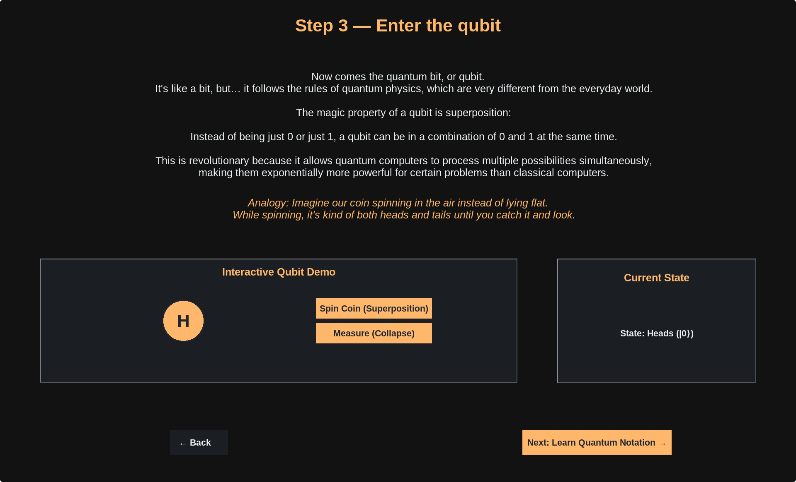
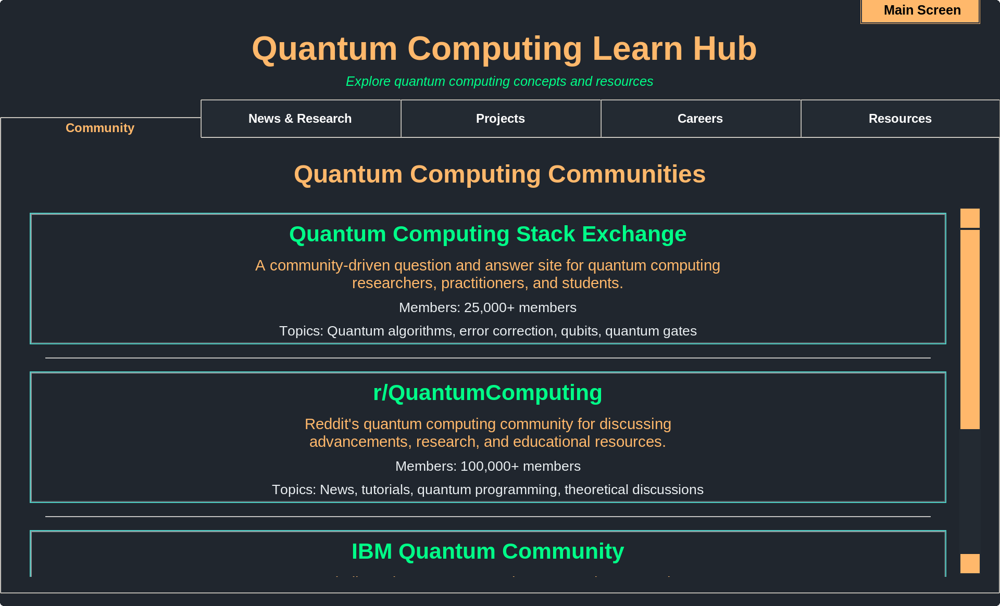
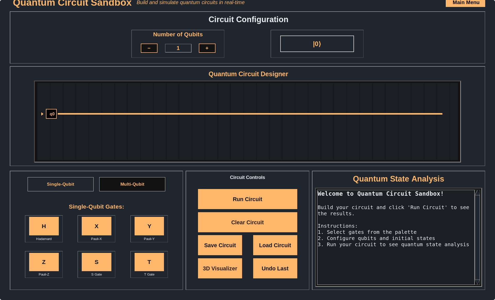
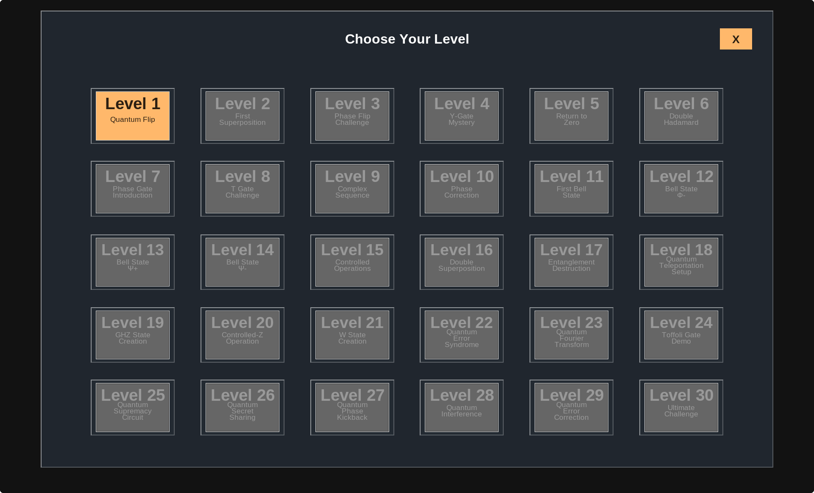

# ⚛️ Infinity Qubit

**An Interactive Quantum Computing Adventure**

Dive into the fascinating world of quantum mechanics through **Infinity Qubit** – an educational puzzle game that transforms complex quantum concepts into engaging, hands-on challenges. Build circuits, manipulate qubits, and master real quantum gates while having fun!

---

## 🚀 Quick Start

### Prerequisites

- **Python 3.8+** (Python 3.10+ recommended)
- **Virtual environment** (optional but recommended)

### Installation

1. **Clone the repository**
   ```bash
   git clone https://github.com/infinity-qubit/infinity-qubit.git
   cd infinity-qubit
   ```

2. **Install dependencies**
   ```bash
   pip install -r config/requirements.txt
   ```

### Running the Game

**Launch with splash screen:**
```bash
python3 run.py
```

**Jump directly into a specific mode:**
```bash
python3 run.py --mode puzzle      # Start solving puzzles
python3 run.py --mode sandbox     # Free-form circuit building
python3 run.py --mode tutorial    # Guided learning experience
python3 run.py --mode learn_hub   # Quantum theory explorer
```

---

## 🎮 Game Modes

Explore quantum computing through four distinct experiences:

| Mode | Description |
|------|-------------|
| 🎓 **Tutorial** | Step-by-step introduction to quantum gates with interactive guidance |
| 🧩 **Puzzle** | Challenge yourself with progressively complex quantum circuit puzzles |
| 🎨 **Sandbox** | Experiment freely – build and test any quantum circuit you imagine |
| � **Learn Hub** | Deep dive into quantum theory, gates, and computational concepts |

---

## 🧠 What You'll Learn

Master quantum computing fundamentals through interactive play:

- **Quantum Superposition** – Understanding qubits in multiple states simultaneously
- **Quantum Entanglement** – Creating and manipulating correlated qubit pairs
- **Gate Operations** – Hands-on experience with H, X, Y, Z, CNOT, Toffoli, and more
- **Circuit Design** – Building quantum algorithms from basic gates
- **Measurement & Probability** – Interpreting quantum measurement outcomes

Learn by doing with instant visual feedback, helpful hints, and immersive sound effects!

---

## ✨ Key Features

- 🎯 **Progressive Learning Curve** – From beginner-friendly tutorials to advanced puzzles
- ⚡ **Real Quantum Simulation** – Powered by IBM's Qiskit framework
- 🎨 **Intuitive Visual Interface** – Clean, colorful circuit diagrams and state visualizations
- 🔊 **Engaging Audio Feedback** – Sound effects that respond to your actions
- 🏆 **Multiple Challenge Levels** – Test your skills across various difficulty tiers
- 🔬 **Sandbox Experimentation** – Try your own quantum circuit ideas without limits

---

## 🖼️ Screenshots

<div align="center">

### Tutorial Mode - Interactive Learning

*Step-by-step guidance to master quantum gates and circuit building*

### Learn Hub - Quantum Theory Explorer

*Deep dive into quantum computing concepts with interactive explanations*

### Sandbox Mode - Circuit Builder

*Design and test your own quantum circuits without constraints*

### Puzzle Mode - Challenge Yourself

*Solve quantum circuit puzzles of increasing complexity*

</div>

---

## 📁 Project Structure

```
├── run.py                      # Main entry point launcher
├── fix_buttons.py              # UI helper script
├── README.md                   # This file
├── config/
│   ├── requirements.txt        # Python dependencies
│   ├── color_palette.json      # UI color configuration
│   └── puzzle_levels_temp.json # Puzzle level data
├── resources/
│   ├── images/                 # Game images and sprites
│   └── sounds/                 # Audio files
└── src/
    ├── main.py                 # Main application entry
    ├── splash_screen.py        # Splash screen
    ├── game_mode_selection.py  # Mode selection menu
    ├── tutorial.py             # Tutorial mode
    ├── puzzle_mode.py          # Puzzle gameplay
    ├── puzzle_level_selection.py # Puzzle level selector
    ├── sandbox_mode.py         # Sandbox circuit builder
    ├── learn_hub.py            # Educational content hub
    ├── run_game.py             # Alternative launcher
    └── q_utils.py              # Quantum utility functions
```

---

## 🤝 Contributing

We welcome contributions from the quantum computing community! Whether you're a student, educator, or quantum enthusiast:

- 🐛 **Found a bug?** Open an issue with details
- 💡 **Have an idea?** Propose new features or puzzles
- 🔧 **Want to contribute?** Fork the repo and submit a pull request

Please include clear descriptions and, where applicable, test cases for your changes.

---

## 📫 Contact & Support

**Created by:** Quantum Qubit Qrew  
**Email:** QuantumQubitQrew@protonmail.com

For questions, suggestions, or collaboration opportunities, feel free to reach out or open an issue on GitHub!

---

## 📜 License

This project is currently unlicensed. If you're interested in using or contributing to this project, please contact the maintainers for more information.

---

<div align="center">

### 🌌 Ready to explore the quantum realm?

**Start your journey into quantum computing today!**

[](https://www.python.org/)
[](https://qiskit.org/)

</div>
